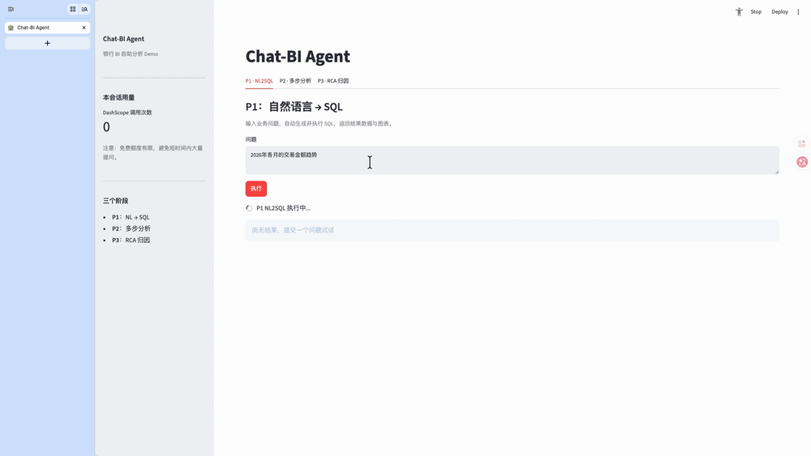

# chat-bi-agent


[](https://opensource.org/licenses/MIT)
[](https://www.python.org/downloads/)
[](https://dashscope.aliyun.com/)

**中文** | [English](./README.en.md)

> **面向银行业务场景的对话式 BI 智能体** —— 把"提需求 → 排期 → 开发报表 → 看报表 → 找数 → 人工归因"的传统链路，压缩成"**一句话提问 → 直接出数 → 自动归因 → 可追问**"。

---

## ✨ 三路径能力

| 路径 | 能力 | 典型问题 |
|---|---|---|
| **P1 精准取数** | 自然语言 → SQL → 取数 → 自动图表 | "上海分行 5 月高净值客户存款余额？" |
| **P2 多步分析** | 拆解 → 多步取数 → 事实抽取 → 综合洞察 | "春节前后现金支取行为有什么变化？" |
| **P3 RCA 归因** | 锚定事实 → 维度下钻 → 事件命中 → 根因合成 | "上海分行存款 5/14 下降 8%，原因是什么？" |



<sub>P1 tab 实录（**已加速**）：提问「2026 年各月的交易金额趋势」→ 生成并执行 SQL → 结果表 → 自动推断图表类型出折线图，末尾 👍 把这条 (question, sql) 送进 few-shot pool 候选。画面底部的「耗时 18043 ms」是这一次**真实**的端到端耗时，未经压缩；全量 8 题 avg 17.7s / p50 12.0s（<a href="results/baseline_p1_eval_2026-08-15.json">baseline JSON</a>）。P2 / P3 暂无录屏。</sub>

---

## 📊 评估成绩

### 自家三路径评测

| 路径 | 题量 | 通过 | 平均分 | baseline | 备注 |
|---|---:|---:|---:|---|---|
| **P1 NL2SQL** | 8 / 8 | 8 | **0.965** | 2026-08-15 | 全量题集；多表 JOIN、时间窗、聚合、分行筛选全过 |
| **P2 多步分析** | 3 / 8 | 1 | **0.626** | 2026-08-17 | 3 维计分（洞察 45% + rubric LLM judge 35% + 多指标 20%）；推理/业务/步骤完整降为诊断 |
| **P3 RCA 归因** | 7 / 7 | 7 | **0.900** · event_hit **7/7** | 2026-06-29 | 4 维 rubric，全部命中埋雷事件、零幻觉 |

「题量」列的分母是评测集里的总题数。**P2 只跑了 8 题里的前 3 题**，q004–q008 从未评过分
——单题 300–500s，补齐要 40–70 分钟，按成本暂缓。

**P2 是本项目唯一持续「往下修」的分数**，因为此前的高分有相当部分是白送的。
2026-08-15/17 分四步修，每一步都是「某个维度声称测 A、实际算 B」：

| 步骤 | 改动 | avg | 通过 |
|---|---|---:|---:|
| 起点 | — | 0.798 | 3/3 |
| ① 修两个静默失效的维度 | 洞察维对中文按空格切词（等于没分词）；指标覆盖维按**单个字**匹配（'长'/'户' 在银行叙述里几乎必然出现） | 0.798 | 3/3 |
| ② 删掉没有真值的两维 | 推理质量、业务相关性**没有可比对的对象**，判据只能是数关键词，实测恒等 1.000——35% 权重是常数而非测量 | 0.655 | 2/3 |
| ③ 补 rubric LLM judge | 照 P3 做 4 维 G-Eval，每维锚在**本题** YAML 字段上 | 0.601 | 0/3 |
| ④ 步骤完整性降为诊断 | 它算的是 `len(计划节点)/len(YAML步数)`——**计划粒度**，不是步骤有没有做 | **0.626** | **1/3** |

②删③加不是自相矛盾：删的两维锚在通用词表上（对任何题目都一样，必然饱和），judge
四维锚在每题人工写死、且写在 agent 跑之前的 `analysis_steps` / `expected_insights` /
`evaluation_criteria` 上。详见 [ADR-015](./DESIGN_DECISIONS.md#adr-015) 与
[ADR-016](./DESIGN_DECISIONS.md#adr-016)。

**④ 是 judge 上线后立刻兑现的收益。** q001：agent 只规划 2 步（YAML 有 5 步）→ 步骤完整性
0.40，而 judge 拿**同一份** `analysis_steps` 判内容给 1.00。人工核对回答全文，5 步的实质
内容全部覆盖 —— judge 是对的，旧维度罚的是「把 5 步并成 2 步做完」。**两个维度同锚而结论
相反，等于互为对照**，这种证伪在只有一种测法时做不到。

**judge 挖出的实质缺陷是 `quantification`：三题 0.50 / 0.00 / 0.00。** 但准确说法不是
「agent 不报数字」—— 它报了很多（q001 有 4 个百分比、13 个大数）。真正的缺口是**不算 gold
要求的派生比率**：q003 把分子分母都查出来了（9141 / 5265 / 720），却从没相除算出赎回率、
续作率；q001 证明它**会**算（319% / −70.7%），q003 只是没算。这件事此前没有任何维度看得见
（`insight_accuracy` 算内容词召回，说到「增长」就算命中，不管报的是 +25% 还是 +3%）。

**别把 1/3 当精确刻度**：q001 两次 agent 跑分别落 0.700 与 0.679（旧口径），跨在及格线
两侧。表里的数来自 `baseline_p2_analysis_2026-08-17_rescored.json` —— 同一份 agent 回答、
仅换评分器**重评**得到，两条出处（agent 跑 / 评分器）分别记在 `run_metadata` 与
`rescorer_metadata`，都是 `commit_dirty=false`。改评分器后重跑 agent 会把「评分器变了」和
「agent 这次跑得不同」搅在一起，所以刻意用重评而非重跑。

**仍未解决，且都卡在同一件事上——`n=3`**：

- `multi_metric_coverage`（20% 权重）在这 3 题上**全满分、零区分度**，候选词
  （率/增长/金额/客户/流）太通用。它在 q001 上取过 0.500，不是纯常数，3 题的证据不足以
  判它该删还是该改。它现在是唯一没被检验过的计分维度。
- `causal_reasoning` / `business_actionability` **下界卡在 0.50**（全部观测里没低过），
  有效量程被压到 [0.5, 1.0]。这**不是饱和**（它们在题间会动，被删的两维才是恒等 1.000），
  但也分不出是判据偏松、还是这 3 份回答本身就是中等水平。
- **q004–q008 从未评过分**（单题 300–500s，补齐 40–70 分钟）。这是上面两条的前置条件：
  n=8 才能判断某一维到底区不区分。按成本暂缓，因此上面两项**是缺证据，不是缺工时**。

**P1 的 0.965 别当精确值读**：同一配置反复跑，8 题 avg 落在 **0.965 ~ 0.977**，差异
**全部**来自 q008 一题（实测取过 0.90 / 0.93 / 1.00），其余七题逐次完全相同。q008 也是
这 8 题里最复杂的（双窗口 + 条件聚合 + 变化率 + Top-N）。表里取的是最新一次可复现的跑
（`commit_dirty=false`），按此规则而非挑最好看的数。这个量级的跑间抖动在本项目是常态，
判断优劣要看逐题比较而非 avg 上的零点几个百分点——详见
[ADR-013](./DESIGN_DECISIONS.md#adr-013)。

<details>
<summary>P1 从「6 题 1.000」改成「8 题全量」的原因</summary>

此前公布的 **6 题 / 1.000** 有两处需要更正，2026-08-14 一并修完：

1. **只跑了 8 题里的 6 题**。`run_p1_eval` 的 `HAPPY_PATH_IDS` 是硬编码白名单，
   排除了 q005、q008。跑开来发现这两题**是 gold 有缺陷，不是 agent 弱**：q005 把余额
   这个 stock 指标跨 28 天日快照相加（得月末真值的 27.4 倍）；q008 题面明写「定期存款」
   而 gold 没有 `account_type` 过滤。两题的 gold 已修，白名单已删。
2. **gold 行数与种子数据脱节**。q001/q003/q004 的 `expected_result_count` 仍是初版
   种子数据的值，reseed 后失真，导致 SQL 逐字符正确也被扣 `result_count` 那档的 0.15
   —— 静默压分而非报错。已按实测回填。

修完后**6 题口径回到 1.000**（可复现），8 题全量 0.965，8/8 全部及格。差额来自
q005（agent 漏了「定期存款」约束，真扣）。

改 gold 有「对着 agent 拟合」的风险，故划了一条边界：只修违反业务语义的、以及
题面写了但 gold 没实现的；解释分歧不改。同时加了
[`tests/eval/test_gold_sql_row_counts.py`](tests/eval/test_gold_sql_row_counts.py)
守门（42 例真打 PG），让行数漂移下次是 CI 红灯而不是静默扣分。完整判断与方法论
见 [DESIGN_DECISIONS.md#adr-014](./DESIGN_DECISIONS.md)。

</details>

详细评估方法见 [EVALUATION_FRAMEWORK.md](./EVALUATION_FRAMEWORK.md)；原始 baseline JSON 在 [`results/`](./results/) 目录（P1 最新为 [`baseline_p1_eval_2026-08-15.json`](results/baseline_p1_eval_2026-08-15.json)）；三路径 markdown 报告 [`results/eval_report_2026-08-15.md`](./results/eval_report_2026-08-15.md)。

P1 默认即跑全量 8 题（`python -m chat_bi_agent.runners.run_p1_eval`）。2026-08-14 之前
这里有一份 `HAPPY_PATH_IDS` 白名单只跑 6 题，随 gold 修复一并删除。

一键复跑：

```bash
python scripts/run_all_evals.py              # 三路径全跑 + 生成 markdown 报告
python scripts/run_all_evals.py --only p3    # 只跑 P3
python scripts/eval_diff.py --phase p3       # 对比最近两个 P3 baseline
```

### 公开 benchmark

- **BIRD-financial dev subset** (n=106，模型 `qwen3.7-max-2026-05-20`)：

  跑了**三个变体**做对照——lean baseline 是外部 benchmark 的**能力天花板**参考；P1 pipeline 是现网系统**原样上跨域数据**的真实表现；P1 (dialect fix) 是**给 SQLGenerator/Validator/Reflector 加了 dialect 参数**后的表现——三个数字放一起才能说清 delta 到底来自哪里：

  | 难度 | n | Lean baseline<br/>(BIRD 专属 prompt) | P1 pipeline<br/>(pre-fix, dialect=postgres) | P1 pipeline<br/>(dialect=sqlite) | Δ dialect vs pre |
  | --- | ---: | ---: | ---: | ---: | ---: |
  | simple | 62 | 64.52% (40/62) | 50.00% (31/62) | 59.68% (37/62) | **+9.68** |
  | moderate | 37 | 48.65% (18/37) | 37.84% (14/37) | 37.84% (14/37) | 0 |
  | challenging | 7 | 28.57% (2/7) | 28.57% (2/7) | 14.29% (1/7) | −14.28 (n=7 噪音) |
  | **overall** | **106** | **56.60%** (60/106) | **44.34%** (47/106) | **49.06%** (52/106) | **+4.72** |

  错误 & 效率对比：

  | | syntax 错 | avg attempts | avg latency |
  | --- | ---: | ---: | ---: |
  | Lean baseline | 0 | 1.00 | 28.6s |
  | P1 pre-fix (postgres) | 27 | 1.58 | 45.4s |
  | P1 dialect fix (sqlite) | **0** | **1.04** | **30.1s** |

  **数字怎么读**：
  - **Lean 56.60%** = LLM + prompt substrate 的能力上限（BIRD 专属英文 SQLite-aware prompt）。
  - **P1 pre-fix 44.34%** = 现网 P1（中文银行域 prompt / sqlglot PG 校验 / Reflector 重试）原样搬过去，PG 方言假设（`EXTRACT(YEAR FROM ...)` / `ILIKE` / `DATE 'YYYY-MM-DD'`）直接在 SQLite 上崩，27 条 syntax 错。
  - **P1 dialect fix 49.06%** = 给 SQLGenerator / SQLValidator / Reflector 加 `dialect` 参数，SYSTEM_PROMPT 换成 SQLite 变体（提 STRFTIME / 不带 DATE 前缀 / LOWER LIKE 代替 ILIKE），sqlglot 用 sqlite dialect，Reflector 加 SYNTAX_ERROR → DIALECT_MISMATCH 兜底分类。**结果：27 条 syntax 错 → 0，avg_attempts 1.58 → 1.04，avg_latency 45.4s → 30.1s，EX +4.72 分**。
  - **Reflector 的 DIALECT_MISMATCH 分类实际触发 0 次**——4 次 att=2 都是普通 SYNTAX_ERROR。SYSTEM_PROMPT 里加的方言规则本身就让 LLM 一次写对，Reflector 兜底是 defence in depth，实际没启用。
  - **gap 从 12.26 分收窄到 7.54 分（关闭 38%）**。剩余 gap 里语义正确性占大头——即使 dialect 正确，日期算术、评估句意的题模型本身也难。

  子集选 `financial`（捷克银行真实数据，8 表）是因为和本项目领域同源、难度对等。评测入口 [`scripts/run_bird_financial.py`](scripts/run_bird_financial.py)（lean）与 [`scripts/run_bird_financial_p1.py`](scripts/run_bird_financial_p1.py)（P1；`--dialect {postgres,sqlite}` 切换），结果分别落盘 [`results/bird_financial_2026-07-01.json`](results/bird_financial_2026-07-01.json) / [`results/bird_financial_p1_2026-07-01.json`](results/bird_financial_p1_2026-07-01.json) / [`results/bird_financial_p1_dialect_2026-07-02.json`](results/bird_financial_p1_dialect_2026-07-02.json)。指标口径与 BIRD 官方 `evaluation.py` 一致（EX = 行集合等价 + `dev_tied_append.json` 42 条补丁）。数据集下载见 [`benchmarks/README.md`](benchmarks/README.md)。

- **Q-SQL few-shot 尝试（2026-07-06）**：把 BIRD 1427 条非 financial dev 题灌成 SQLite 向量池（financial 严格排除防泄题），SQLGenerator 注入 top-k similar 作 few-shot，跑 106 题 A/B：

  | 变体 | EX | 备注 |
  | --- | ---: | --- |
  | few-shot **off**（Jul-2，`qwen3.7-max`） | **49.06%** (52/106) | 基线 |
  | few-shot @ `min_sim=0.55`（Jul-6，同模型） | **52.83%** (56/106) | +3.77 EX，**但逐题分析 8/8 翻转题 few-shot 未激活**——+3.77 归因模型日间噪声 |
  | few-shot @ `min_sim=0.4`（Jul-6，`preview` 分支） | 53.77% | **数据被污染**，跨了模型；20 题探针在 pinned 上给 -2 反向信号 |

  **诚实结论**：BIRD 跨库场景下 few-shot 净效应 ≈ 0。这是 few-shot 最差场景（跨库 pool 语义距离天然大，financial 严格排除后可迁移的信号仅剩 SQLite 方言）。之前一度报告的"latency -40%"经复核是伪信号（preview 有 3 道题命中 300s agent_exception 拉高平均）。**功能已上线，默认关闭**，待同域生产 pool（历史 judge=1 的 Q-SQL 对）建成后再验证真实收益。完整分析见 [DESIGN_DECISIONS.md#adr-012](./DESIGN_DECISIONS.md)。

- **生产同域反馈闭环**（2026-07-07）：Streamlit 三个 tab（P1/P2/P3）每条回答下方都有 👍/👎，点击后通过 Langfuse `score(name="user_feedback")` 挂到当前 trace。生产 P1 agent 会 hot-load [`data/example_pool_prod.jsonl`](data/example_pool_prod.jsonl)（gitignored）作 few-shot，`min_sim=0.7` 严格阈值宁缺毋滥；池空时零成本 fallback。夜间 cron 通过 [`scripts/nightly_promote.sh`](scripts/nightly_promote.sh) 或 `make promote-pool` 拉最近 1 天 👍 过的 P1 (question, sql) 追加到 pool（bootstrap script 按 sha1(q||sql)[:12] 去重，重复运行幂等）。首次 bootstrap 从 [`results/baseline_p2_validator_reflector_2026-06-03.json`](results/baseline_p2_validator_reflector_2026-06-03.json) 抽 6 条 P1 gold 样例做种。攒到 30+ 条真实使用样本后跑同域 A/B（`python -m chat_bi_agent.runners.run_p1_eval --example-pool data/example_pool_prod.jsonl` + [`scripts/verify_ab.py`](scripts/verify_ab.py) 守门），对齐 [DESIGN_DECISIONS.md#adr-012](./DESIGN_DECISIONS.md) 跟进项。

- **语义层 / Metric Resolver 原型**（2026-07-08）：[`config/metrics.yaml`](config/metrics.yaml) 定义 6 个种子银行业务指标（存款/贷款余额、AUM、客户数、产品数、交易金额），[`src/chat_bi_agent/agents/p1/metric_resolver.py`](src/chat_bi_agent/agents/p1/metric_resolver.py) 用 LLM 抽 `{metric_id, dims, filters, time_window}` → 套模板拼 SQL。enum 严格校验（"高净值"→`HIGH_NET_WORTH`），join 自动去重，未命中优雅抛错回退。4-题 Qwen smoke：3 命中生成正确 SQL + 1 list 查询 fallback；已知限制 `op='='` 不支持 IN（多值筛选）。**未与 SQLGenerator 主路径集成**——原型独立可跑，下次 iteration 加前置路由 + A/B。详见 [DESIGN_DECISIONS.md#adr-013](./DESIGN_DECISIONS.md)。

- **语义层前置路由接线到 P1**（2026-08-12）：`MetricRouter`（[`src/chat_bi_agent/agents/p1/metric_resolver.py`](./src/chat_bi_agent/agents/p1/metric_resolver.py)）在 P1 主路径 SchemaLinker 之前跑 embedding cosine prefilter（默认阈值 0.63，`--metric-prefilter-threshold` 可覆盖）；命中 → `resolve()` 抽 spec → render template SQL → SQLValidator + Executor 跑通即返 `route="metric"`（跳过 Reflect Loop），否则 fallback 回原路径（`route="metric_then_nl2sql"` 或 `"nl2sql"`，`metric_fail_reason` 记录退回原因）。`P1AgentResult` 新增 `route / metric_id / prefilter_cosine / metric_spec / metric_fail_reason` 5 字段；`results/*.json` 顶层新增 `metric_router` 段（含 `metric_hit_rate` / `precision_when_hit` / `precision_when_bypass` / `fallback_rate` / `fail_reason_breakdown`）。同时补 `op='IN'` 多值过滤，消除 smoke Q3（杭州+南京）的已知假阳性。**生产 P1 tab 已接入**（命中时显示业务名并摊开语义层的理解；构造失败自动降级，不影响主路径）；P2/P3 tab 暂未接。CLI 里不传 `--metric-catalog` 时行为与之前完全一致。跑法：

  ```bash
  # baseline
  python -m chat_bi_agent.runners.run_p1_eval \
      --output results/p1_prod_baseline_YYYY-MM-DD.json
  # 开启 metric router
  python -m chat_bi_agent.runners.run_p1_eval \
      --metric-catalog config/metrics.yaml \
      --metric-prefilter-threshold 0.7 \
      --output results/p1_prod_metric_YYYY-MM-DD.json
  # 守门
  python scripts/verify_ab.py \
      results/p1_prod_baseline_YYYY-MM-DD.json \
      results/p1_prod_metric_YYYY-MM-DD.json \
      --expected-differ metric_router
  ```

  两轮必须在**同一个 commit、同一个模型上跑**——`verify_ab.py` 把 `commit_hash` 与 `model` 当 CRITICAL 字段。注意 `precision_when_bypass` **不会**与 baseline 完全相等：那些题两臂走同一条 nl2sql 路径，但 LLM 有跑间噪声，实测单题可达 ±0.4。因此别看 avg_score 上零点几个百分点的差异，要看**逐题、且走 governed 路径**的比较——模板 SQL 是确定性的。对齐 [ADR-013 Update 2026-08-12](./DESIGN_DECISIONS.md#adr-013)。

  **A/B 判定绿灯,默认阈值 0.63**（2026-08-13，34 题指标路由标尺，`qwen3.7-max`）：路由 precision **1.000**（零假阳性）、recall 0.75、F1 0.857、命中率 0.441；走语义层的 15 题里 **2 题更好、13 题持平、0 题更差**。相比 t=0.70（recall 仅 0.45）严格占优。早期那套 6 题 happy path 指标型仅 2 题、命中率天花板 0.333，已判定为不合格标尺并替换。详见 [ADR-013 Update](./DESIGN_DECISIONS.md#adr-013)。

  换 **embedding 模型**后必须重扫阈值（cosine 尺度会变）——只花 embedding 的钱，几十秒，不必跑整轮 eval：

  ```bash
  python scripts/sweep_prefilter_threshold.py
  ```

  结果 JSON 里 `result_match` 段是**结果集比对**诊断：它抓的是分数看不见的"语义不忠实"（丢约束、丢 Top-N、值域塞错——SQL 合法、表/过滤/聚合全对，但答的是另一个问题）。`mismatched_ids` 直接点名是哪几题。刻意不计入 `combined_score`，以免废掉历史 baseline 的可比性。

  catalog 改动后请跑一遍全组合回归（18 metric × 全部 dim/filter 真打 PG），模板里的列名只有真正 execute 才会被校验：

  ```bash
  pytest tests/p1/test_p1_agent_routing_integration.py -m integration  # 需 chatbi-pg up
  ```

---

## 🏗 系统架构

```
                       ┌─────────────────────────────┐
                       │  Streamlit Web UI (3 Tabs)  │
                       │   P1 取数 / P2 分析 / P3 RCA  │
                       └──────────────┬──────────────┘
                                      │
       ┌──────────────────────────────┼──────────────────────────────┐
       │                              │                              │
       ▼                              ▼                              ▼
┌─────────────┐              ┌─────────────────┐            ┌───────────────────┐
│ P1 NL2SQL   │              │ P2 Multi-Step   │            │ P3 RCA Agent      │
│ Agent       │              │ Analysis Agent  │            │ (5-step pipeline) │
│             │              │                 │            │                   │
│ SchemaLink  │◄──reuse──────┤  Planner        │            │ 1. fact_anchor    │
│ SQLGen      │              │  ↓              │            │    (调 P1 取锚)    │
│ SQLValidate │              │  P1 Agent (×N)  │◄──reuse────┤ 2. drill_select   │
│ SQLExecute  │              │  ↓              │            │ 3. drill_run      │
│ Reflector   │              │  FactExtractor  │            │    (Pareto Top-K) │
│ (×1 retry)  │              │  ↓              │            │ 4. event_match    │
│             │              │  InsightSynth   │            │    (YAML 时间窗)  │
│             │              │  ↓              │            │ 5. synthesize     │
│             │              │  ReportWriter   │            │    (narrative)    │
└──────┬──────┘              └────────┬────────┘            └────────┬──────────┘
       │                              │                              │
       └──────────────────┬───────────┴──────────────────────────────┘
                          │
       ┌──────────────────┼──────────────────┐
       ▼                  ▼                  ▼
┌─────────────┐  ┌────────────────┐  ┌──────────────────┐
│ Qwen3.7     │  │ PostgreSQL 16  │  │ Langfuse v3      │
│ (DashScope) │  │ (read-only     │  │ (self-hosted)    │
│ + Embedding │  │  user enforced)│  │ 全链路 trace      │
└─────────────┘  └────────────────┘  └──────────────────┘
```

**架构要点**：
- **三个独立 Agent，各管一条路径**（不强行复用一个 super-agent）
- **P2/P3 复用 P1 作原子取数层**（FactAnchor / 多步 plan 的每一步都是 P1 调用）
- **编排是函数链 + Langfuse `@observe` 装饰器**，**没用 LangGraph**（流程固定不需要图）
- **LLM 单源**（Qwen 既做生成也做评分），**没有独立 judge 模型**
- **P3 ground truth 用 YAML 事件库 + 传播引擎埋雷**（可控、可重放、可量化）

完整设计取舍见 [DESIGN_DECISIONS.md](./DESIGN_DECISIONS.md)。

---

## 🚀 Quick Start

### A. Docker Compose 一键（推荐）

```bash
git clone https://github.com/Zsyyxrs/chat-bi-agent.git
cd chat-bi-agent

# 1. 配置 API key
cp .env.example .env
# 编辑 .env，填入 DASHSCOPE_API_KEY（必填）

# 2. 起全栈（Postgres + Langfuse 全套 + Streamlit App）
docker compose up -d

# 3. 灌种子数据 + 埋雷事件（一次性 job）
docker compose --profile seed run --rm seed

# 4. 首次启动需要在 Langfuse 创建 API Key
#    访问 http://localhost:3001 → admin@chatbi.local / admin12345
#    Settings → API Keys → 新建一对 → 回填到 .env 的 LANGFUSE_PUBLIC_KEY / SECRET_KEY
#    然后 docker compose restart app

# 5. 打开 Streamlit
open http://localhost:8501
```

服务端口：
- Streamlit App：`http://localhost:8501`
- Langfuse UI：`http://localhost:3001`
- pgAdmin：`http://localhost:5050`
- Postgres：`localhost:5433`（容器内仍 5432）

### B. 本地开发

```bash
python -m venv .venv && source .venv/bin/activate
pip install -e ".[dev]"

# 起 Postgres + Langfuse（不起 App）
docker compose up -d postgres langfuse pgadmin

# 灌数据
python -m chat_bi_agent.data.seed --truncate --with-events

# 本地跑 Streamlit
streamlit run streamlit_app/app.py
```

### 跑评估

```bash
python scripts/run_all_evals.py                    # 三路径全跑
python scripts/run_all_evals.py --only p1          # 只跑 P1
python scripts/run_all_evals.py --skip p2,p3       # 跳过 P2/P3
python scripts/run_all_evals.py --p3-limit 2       # P3 只跑前 2 题（省 token）
python scripts/run_all_evals.py --report-only      # 不跑，仅基于最新 baseline 生成报告

python scripts/eval_diff.py --phase p3             # 对比最近两个 P3 baseline
python scripts/eval_diff.py --phase p3 \
    --base results/baseline_p3_rca_2026-06-28.json \
    --head results/baseline_p3_rca_2026-06-29.json
```

---

## 🎬 Demo

P1 的实录 GIF 在页首「三路径能力」表下方。**P2 / P3 没有录屏**——P2 单题 300–500s、P3 同量级，
实时录制不可看，加速到能看的倍率又会让人误判真实延迟；这两条路径的产出是大段归因文字，
后续补静态截图更合适。

想自己看全套，按 Quick Start A 起 Streamlit，三个 tab 各试一题：

- **P1 tab**：输入"上海分行 2026 年 5 月高净值客户的存款余额总额是多少？"
- **P2 tab**：输入"春节前后现金支取行为有什么变化？"
- **P3 tab**：输入"上海分行高净值客户的存款在 2026-05-14 突然下降了 8%，可能是什么原因？"

每条提问都会在 Langfuse 留下完整 trace（http://localhost:3001 实时可看）。

---

## 🧱 项目结构

```
chat-bi-agent/
├── src/chat_bi_agent/
│   ├── agents/                # 三个 Agent + 共享组件
│   │   ├── p1/                #   nl2sql_agent · sql_generator · sql_validator · reflector
│   │   ├── p2/                #   p2_analysis_agent · planner · fact_extractor · insight_synthesizer · report_writer
│   │   ├── p3/                #   p3_rca_agent · fact_anchor · drilldown_selector · drill_executor · event_matcher · synthesizer
│   │   └── shared/            #   schema_linker · sql_executor
│   ├── runners/               # P1/P2/P3 evaluation runners
│   ├── llm/                   # qwen_client.py + langfuse_setup.py
│   ├── viz/                   # chart_inference (rule-based) + plotly_renderer
│   ├── eval/                  # precision / multi-step / rca evaluators
│   ├── data/
│   │   ├── seed.py            #   种子数据生成 CLI
│   │   └── events/            #   YAML 埋雷事件库（4 个真实场景）
│   ├── schema/                # 表/列元数据 loader
│   └── config.py              # YAML + 默认值合并
│
├── streamlit_app/
│   ├── app.py                 # 三 tab 入口
│   ├── tabs/{p1_nl2sql,p2_analysis,p3_rca}.py
│   └── components/{chart,dataframe,sql,insight}_block.py
│
├── scripts/
│   ├── run_all_evals.py       # 一键跑齐 P1+P2+P3 + 生成 markdown 报告
│   ├── eval_diff.py           # baseline 回归检测
│   ├── verify_events.py       # 埋雷事件传播验证
│   ├── rejudge_baseline.py    # 重新跑 LLM judge
│   └── calibrate_magnitudes.py
│
├── config/local.yaml          # 运行时配置（模型名、检索 top_k、PG 超时等）
├── tests/                     # 316+ 测试，按 p1/p2/p3/shared/data/viz/eval/schema 分目录
├── results/                   # 评估 baseline JSON + markdown 报告
├── docker-compose.yml         # Postgres + Langfuse 全套 + App + Seed
├── Dockerfile                 # Streamlit 镜像
├── EVALUATION_FRAMEWORK.md    # 三路径评估方法详解
├── DESIGN_DECISIONS.md        # 技术选型 + 演进史 + ADR
└── CONTRIBUTING.md
```

---

## 🛠 技术栈

| 类别 | 选型 | 备注 |
|---|---|---|
| LLM（生成 + 评分） | 当前 `qwen3.7-max`（DashScope；ADR-001 立项时为 Qwen3.6-max-preview） | 单源，中文银行场景 → ADR-001 |
| 嵌入 | text-embedding-v4（DashScope，dim=1024） | schema 检索用 |
| 可观测性 | Langfuse v3（self-hosted） | 全链路 trace + LLM judge 评分回流 → ADR-003 |
| Agent 编排 | 自研函数链 + `@observe` 装饰器 | 流程固定，未用 LangGraph → ADR-002 |
| SQL 解析/校验 | sqlglot | AST 改写 + 多方言 |
| 中文分词 | jieba | schema 检索预处理 |
| 数据库 | PostgreSQL 16 | 只读用户隔离（chatbi_readonly） |
| Web UI | Streamlit | Demo 取向，3 倍开发速度 → ADR-009 |
| 可视化 | Plotly | 6 种图表自动推断（rule-based） |
| 测试 | pytest（316+ 项） + ruff | CI on GitHub Actions |

完整决策理由与替代方案对比见 [DESIGN_DECISIONS.md](./DESIGN_DECISIONS.md)。

---

## 📖 文档导航

- [DESIGN_DECISIONS.md](./DESIGN_DECISIONS.md) —— 技术选型对比 + 架构演进史 + 10 条 ADR
- [EVALUATION_FRAMEWORK.md](./EVALUATION_FRAMEWORK.md) —— 三路径评估方法、问题集、rubric、ground truth
- [金融 data agent 架构设计](./docs/金融data%20agent架构设计.md) —— 业务背景与原始设计稿
- [CONTRIBUTING.md](./CONTRIBUTING.md) —— 开发环境与贡献流程

---

## 🧪 测试与代码质量

```bash
pytest -m "not integration" -v             # 单元测试（无需 Postgres）
pytest -v                                  # 全部；集成测试在 PG 不可达时会干净跳过
pytest tests/p3 -v                         # 只跑 P3
pytest --cov=src/chat_bi_agent --cov-report=html   # 覆盖率报告 → htmlcov/

ruff check src/ tests/ streamlit_app/ scripts/
ruff format src/ tests/ streamlit_app/ scripts/
```

集成测试（`@pytest.mark.integration`，46 个）需要**跑着的 Postgres + 完整种子数据**。
判断依据是真打一次 `SELECT 1`，**不是看 `PG_HOST` 有没有值**——`.env` 里它恒有值，
拿它当开关会让没起 docker 的人撞一堆连接错误而不是跳过。

### CI（`.github/workflows/ci.yml`）三个 job

| job | 内容 |
|---|---|
| `test` | ruff + 单元测试，Python 3.11/3.12 矩阵，覆盖率门槛 `--cov-fail-under=72`（实测 76） |
| `integration` | 起 `postgres:16-alpine` service → 建表 → `seed --rows 100000 --seed 42 --with-events` → 跑 46 个集成测试 |
| `audit` | `pip-audit --skip-editable`，依赖漏洞审计 |

`--seed 42` 是硬要求：43 个 gold SQL 行数守门断言的是**具体行数**（如 674 行），
换种子全红。这些守门在 2026-08-18 之前从未在 CI 执行过，而 gold 行数正是
2026-08-14 那次 P1 分数失真的根源，恰恰最需要 CI 兜住——详见
[ADR-014](./DESIGN_DECISIONS.md#adr-014)。

覆盖率范围只含 `src/chat_bi_agent`：`streamlit_app` 是薄渲染壳，其真实逻辑
（`viz/` 96%、`llm/langfuse_feedback.py` 100%）已在核心包内覆盖，把它算进门槛
只会把已知缺口编码成一个更低的数字。

---

## 📄 License / Author

MIT License · Shangyi Zhu · zhusayi1994@gmail.com

如有问题或反馈欢迎邮件或 Issue。

---

**最后更新**：2026-07-06
